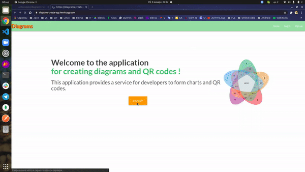
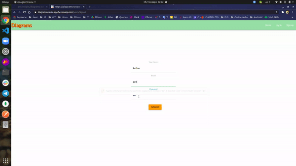
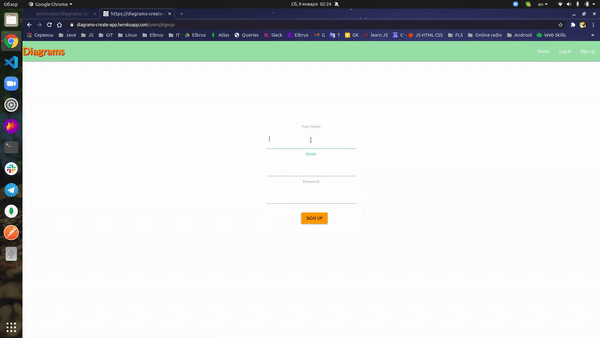
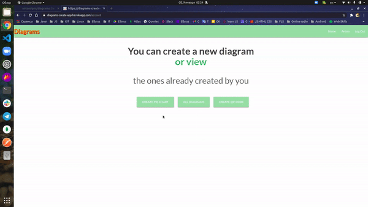
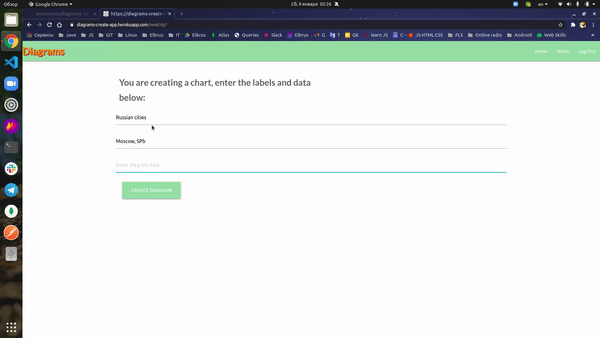
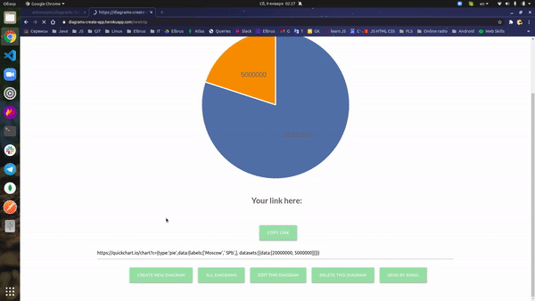
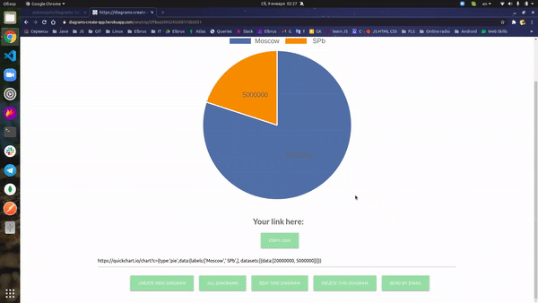
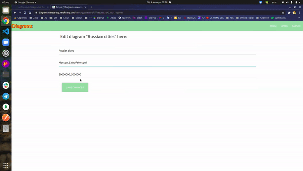
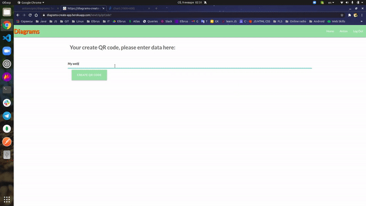
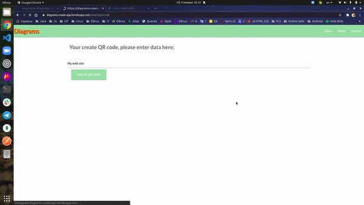

# Diagrams App

  This application provides a service for developers to form charts and QR code links in their applications.

 <h3>
Techs: HTML, CSS, JavaScript, Express.js, Node.js, MongoDB Cluster, HandleBars, Material UI, REST API, QuickChart GraphViz API.
 </h3> 
  <h3>
  The app is available on Heroku: https://diagrams-create-app.herokuapp.com/
  </h3>
<h3> 
  How to start the app locally:
  </h3> 
  

  <ul>
    <li>
      Clone this repo <b><i> git clone git@github.com:antonsipin/diagrams.git</i></b>
    </li>
    <li>
      Install the dependencies <b><i> npm install </i></b>
    </li>
    <li>
      Place the <b>.env</b> file in the root directory (you can get it from me or take a look at <b>.envexample</b> file)
    </li>
    <li>
      Run the app <b><i> npm start </i></b> (The app starts at http://localhost:3000. Open this link in browser and you will be able to test the app)
    </li>
  </ul>
  
 
  
  
  <h3 align="center">
   
Email verification:
 
   
  
   
Password verification:
 
   
  
  
Authorization:
 
   
  
  
Entering data for a chart:
 
   
  
  
Creating a link for a GET request:
 
   
  
  
View all charts:
 
   
  
  
Editing a chart:
 
   
  
  
Editing a chart:
 
   
  
  
Copying the link and sending a GET request:
 
   
  
  
Data entry for QR code generation:
 
   
  
  
Creating a link for a GET request:
 
   
  
  
  </h3>
